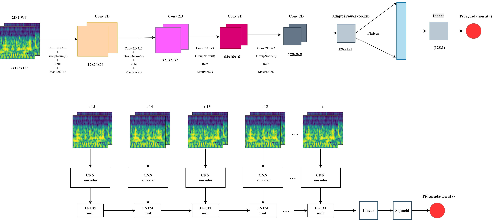
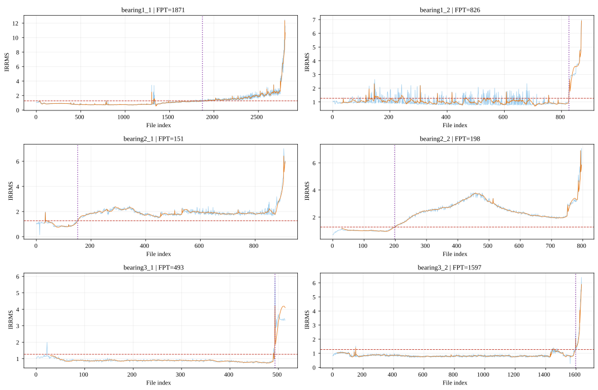
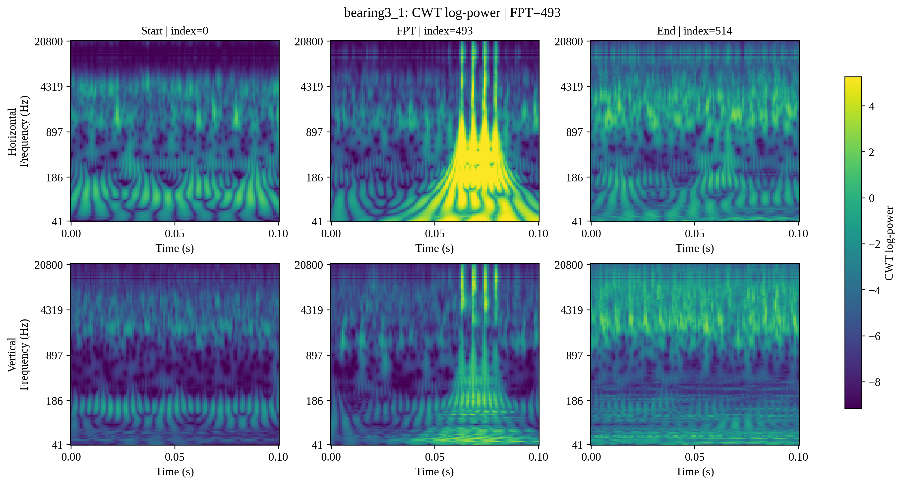

<div align="center">

# Bearing Degradation-Onset (FPT) Detection with CWT Images, CNN and CNN-LSTM

**Does temporal context help? A leakage-controlled comparison of a single-image CWT-CNN and a 16-step CWT-CNN-LSTM for detecting the First Predicting Time of rolling bearings on PRONOSTIA.**

[](https://www.python.org/)
[](https://pytorch.org/)
[](https://github.com/vutrilongdp-create/bearing---fpt---cwt--cnn---lstm/actions/workflows/tests.yml)
[](LICENSE)

</div>

<p align="center">
  
</p>

## Overview

Rotating machines in mining (motors, conveyors, crushers) run under harsh, variable
loads, and rolling-bearing faults account for roughly 40–50% of motor failures.
Before Remaining Useful Life (RUL) can be estimated, a predictive-maintenance system
has to know **when degradation starts**, the *First Predicting Time* (FPT).

This repository contains the full experimental pipeline behind the paper
*“Remaining Useful Life Prediction of Rotating Equipment in Mining Applications Using
Vibration Signals and a CNN–LSTM Model”* (ERSD 2026). It:

1. builds a **causal, frozen FPT reference** for each bearing from an IRRMS health indicator;
2. converts 2-channel raw vibration signals into **Continuous Wavelet Transform (CWT) images**;
3. trains two models under an **identical, leakage-controlled protocol**:
   - **CWT-CNN**: one CWT image at time *t* → P(degraded at *t*)
   - **CWT-CNN-LSTM**: a causal sequence of 16 CWT images `[t-15 … t]` → same CNN encoder → LSTM → P(degraded at *t*)
4. converts per-sample probabilities into an **event-level FPT** and compares the models on
   absolute FPT error, early (pre-FPT) false alarms and sample-level classification metrics.

**Key finding:** with the same folds, scalers, labels, seeds, loss and stopping rule,
the simpler **CWT-CNN detected FPT more accurately than CWT-CNN-LSTM** (median absolute
FPT error 83 vs 369 files). On this data, adding temporal context did not improve onset detection.

## Highlights

- **End-to-end research pipeline**: signal processing (CWT), deep learning (PyTorch CNN / CNN-LSTM) and evaluation, run on Kaggle GPUs.
- **Strict leakage control**: 6-fold *leave-one-bearing-out* CV with an outer-test bearing that never touches scaler fitting, epoch selection, early stopping or threshold choice.
- **Fair model comparison**: both models share folds, per-channel z-score scalers, target universe (`t ≥ 15`), labels, seed (`274`), loss, sampler and stopping rule. The encoders start from the same initial weights but are trained independently.
- **Reproducible notebooks**: each Kaggle notebook is generated from a Python script and checked by **104 contract tests** (`pytest`) covering protocol rules, leakage guards, shapes and metrics.
- **Honest reporting**: fixed-threshold (P = 0.5) results are the primary analysis. Inner-validation threshold calibration is reported separately as a sensitivity analysis, and early false alarms are shown, not hidden.

## Method

### 1. Dataset: PRONOSTIA (FEMTO-ST, IEEE PHM 2012)

Six run-to-failure *learning* bearings (`bearing1_1, 1_2, 2_1, 2_2, 3_1, 3_2`) under three
operating conditions. Each file is a 0.1 s snapshot (2,560 samples at 25.6 kHz) from a horizontal and a
vertical accelerometer, recorded every 10 s. The official test set stays closed and is never used.

### 2. Causal FPT reference (IRRMS)

RMS is normalised by the first 100 healthy files, smoothed with a causal 30-file window
(IRRMS), and FPT is declared at the first of **5 consecutive** exceedances of a threshold of
**1.2638**. That threshold comes from the 99th percentile of the healthy baseline and is frozen
before any model is trained. A 30-file recovery rule rejects transient spikes.

<p align="center">
  
</p>

| Bearing | 1_1 | 1_2 | 2_1 | 2_2 | 3_1 | 3_2 |
|---|---:|---:|---:|---:|---:|---:|
| Files | 2803 | 871 | 911 | 797 | 515 | 1637 |
| Reference FPT (file index) | 1871 | 826 | 151 | 198 | 493 | 1597 |

### 3. CWT images

Morlet wavelet, 128 log-spaced scales (1–512), log-power, resized to **2 × 128 × 128**
(horizontal + vertical channel). Per-channel z-score scalers are fitted **only on the 4 training bearings** of each fold.

<p align="center">
  
</p>

### 4. Models and training

| | CWT-CNN | CWT-CNN-LSTM |
|---|---|---|
| Input | 1 image `2×128×128` | 16 images `[t-15 … t]` |
| Encoder | 4 × (Conv3×3 → GroupNorm(8) → ReLU → MaxPool) → AdaptiveAvgPool → 128-d | same encoder (same init) |
| Temporal | – | LSTM, hidden 128 |
| Head | Linear → Sigmoid | Linear → Sigmoid |

Shared training setup: `BCEWithLogitsLoss`, `WeightedRandomSampler` for class balance,
AdamW (lr 1e-4, weight decay 1e-4), batch 64, up to 50 epochs, early stopping (patience 8)
on the **inner-validation bearing**. Predicted FPT = first of 5 consecutive files with P ≥ threshold.

**Cross-validation:** each fold uses 4 training bearings, 1 inner-validation bearing and 1 outer-test bearing.

## Results

Primary analysis, fixed threshold **P = 0.5**, outer-test bearings of the 6 folds
(full tables in [`results/metric_tables`](results/metric_tables) and [`results/paper_ready_results`](results/paper_ready_results)).

### Model summary

| Model | Mean abs. FPT error ↓ | Median abs. FPT error ↓ | Recall | F1 | AUC-PR | Balanced Acc. | Missed FPT | Pre-FPT alarm runs |
|---|---:|---:|---:|---:|---:|---:|---:|---:|
| **CWT-CNN** | **464.0** | **83.0** | **0.838** | **0.662** | **0.974** | **0.831** | 0 | 2 |
| CWT-CNN-LSTM | 567.8 | 369.0 | 0.773 | 0.594 | 0.888 | 0.768 | 0 | 2 |

### FPT per bearing (error in files; 1 file = 10 s)

| Outer-test bearing | Ref. FPT | CNN pred. | CNN error | CNN-LSTM pred. | CNN-LSTM error | Better |
|---|---:|---:|---:|---:|---:|---|
| bearing1_1 | 1871 | 15 | 1856 | 15 | 1856 | tie |
| bearing1_2 | 826 | 64 | 762 | 26 | 800 | CNN |
| bearing2_1 | 151 | 280 | 129 | 876 | 725 | CNN |
| bearing2_2 | 198 | 235 | 37 | 211 | **13** | CNN-LSTM |
| bearing3_1 | 493 | 493 | **0** | 496 | 3 | CNN |
| bearing3_2 | 1597 | 1597 | **0** | 1607 | 10 | CNN |

**Sensitivity analysis.** With thresholds calibrated on the inner-validation bearing only, the
mean absolute FPT error drops to **254.8** for CWT-CNN and **452.8** for CWT-CNN-LSTM
([details](results/paper_ready_results/paper_ready_results_summary.md)).

**Limitations.** Both models raise early false alarms on `bearing1_1` and `bearing1_2`, whose
long healthy phases contain transient spikes. Six bearings is a small sample, so the comparison
is evidence for this setup, not a general claim.

## Repository structure

```text
.
├── notebooks/                 # Kaggle pipeline (run in order 01 → 06)
│   ├── 01_rrms_fpt_reference_kaggle.ipynb          # causal IRRMS FPT reference
│   ├── 01b_irrms_paper_audit_kaggle.ipynb          # threshold sensitivity audit
│   ├── 02_prepare_cwt_cache_kaggle.ipynb           # raw signal -> CWT cache
│   ├── 02b_cwt_paper_figures_kaggle.ipynb          # CWT figures
│   ├── 03_prepare_fold_scalers_kaggle.ipynb        # leave-one-bearing-out folds + scalers
│   ├── 04_validate_fpt_model_contract_kaggle.ipynb # model / data contract checks
│   ├── 05_train_cnn_vs_cnn_lstm_kaggle.ipynb       # training + FPT evaluation
│   ├── 06_calibrated_threshold_fpt_analysis_kaggle.ipynb  # inner-val threshold calibration
│   ├── create_*_notebook.py   # scripts that generate the notebooks above
│   ├── *_vhi2 / cwt_hi_*      # earlier exploratory iterations (health-index variants)
│   └── tests/                 # 104 pytest contract tests
├── scripts/                   # build paper tables & figures from saved artifacts
├── results/
│   ├── 01_fpt_reference/      # frozen FPT reference + IRRMS threshold sensitivity
│   ├── 02_cwt_figures/        # CWT images before / at / after FPT
│   ├── 03_fold_scalers/       # fold manifest, per-fold scalers, audit
│   ├── 04_training_cnn_vs_cnn_lstm/  # checkpoints (.pt), histories, predictions, metrics
│   ├── 05_threshold_calibration/     # inner-validation calibrated run
│   ├── metric_tables/         # primary model metric tables
│   └── paper_ready_results/   # paper tables and figures
├── figures/                   # figures used in this README
└── docs/architecture/         # editable draw.io model diagrams
```

## Getting started

```bash
git clone https://github.com/vutrilongdp-create/bearing---fpt---cwt--cnn---lstm.git
cd bearing---fpt---cwt--cnn---lstm
python -m venv .venv && source .venv/bin/activate   # Windows: .venv\Scripts\activate
pip install -r requirements.txt
```

**Run the tests** (no dataset or GPU needed):

```bash
pytest notebooks/tests -q
```

**Rebuild the result tables** from the saved artifacts in `results/`:

```bash
python scripts/create_primary_model_metric_tables.py
python scripts/create_paper_ready_results.py
```

**Re-run the full pipeline.** Download the PRONOSTIA learning set
([FEMTO-ST / IEEE PHM 2012 challenge](https://github.com/wkzs111/phm-ieee-2012-data-challenge-dataset)),
upload it as a Kaggle dataset, then run notebooks `01 → 06` on Kaggle (GPU recommended),
attaching each notebook's output as the next one's input. Paths are set at the top of each
notebook (`/kaggle/input/...`). To change a notebook, edit its `create_*_notebook.py`
generator and regenerate it so the contract tests stay in sync.

## Acknowledgements

- The PRONOSTIA dataset: P. Nectoux et al., *PRONOSTIA: An experimental platform for bearings accelerated degradation tests*, IEEE PHM 2012.
- This work started from the CWT + CNN-LSTM RUL pipeline of
  [Abhijit-Bhumireddy99/RUL_Prediction](https://github.com/Abhijit-Bhumireddy99/RUL_Prediction)
  (Bhumireddy et al., 2021). It reframes the task as FPT detection and rebuilds the protocol to remove leakage.

## Citation

If you use this code, please cite the paper (see [`CITATION.cff`](CITATION.cff)):

```bibtex
@inproceedings{loan2026fpt,
  title     = {Remaining Useful Life Prediction of Rotating Equipment in Mining Applications Using Vibration Signals and a CNN--LSTM Model},
  author    = {Pham, Thi Thanh Loan and Vu, Tri Long and Ngo, Ba Hung},
  booktitle = {National Conference on Earth and Resource Sciences for Sustainable Development (ERSD 2026)},
  year      = {2026}
}
```

## Author

**Vu Tri Long**, University of Transport and Communications, Hanoi, Vietnam.

## License

Code is released under the [MIT License](LICENSE). The PRONOSTIA dataset is not
redistributed here and remains subject to its original terms.
